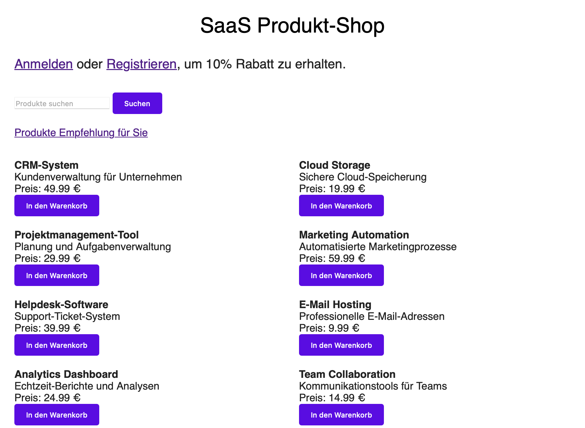
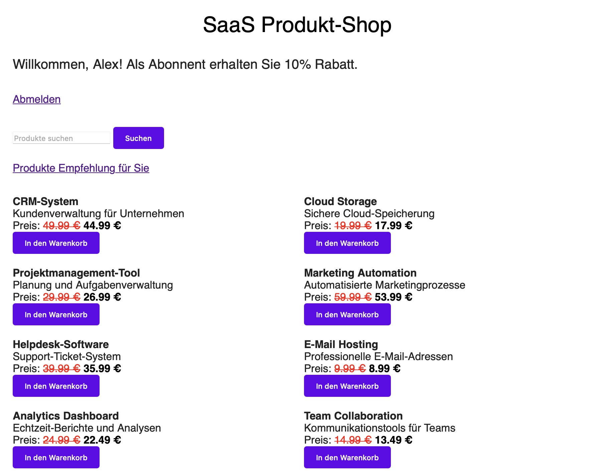

# 🛍️ SaaS Produkt-Shop mit FastAPI

## 📄 Projektbeschreibung

Dieses Projekt stellt einen funktionsfähigen SaaS-Onlineshop als Minimum Viable Product (MVP) dar, entwickelt mit FastAPI und modernen Webtechnologien. Sensible Informationen werden verschlüsselt gespeichert. Das Projekt nutzt gängige DevOps- und Entwicklungspraktiken wie Dockerisierung, Tests, Umgebungsvariablen und Versionskontrolle über Git.

Die App ermöglicht eine separate Verwaltung von zwei Nutzerkategorien: Gästen, die ohne Anmeldung surfen, und angemeldeten Benutzern, die Zugang zu erweiterten Funktionen haben (z. B. 10 % Rabatt):

<div style="display: flex; justify-content: center; gap: 40px; align-items: flex-start;">
  <div style="text-align: center;">
    <h3>🔓 Gastansicht</h3>
    
  </div>
  <div style="text-align: center;">
    <h3>👤 Benutzeransicht mit Rabatt</h3>
    
  </div>
</div>


---

## 🛠️ Tools & Technologien

- **Programmiersprachen & Frameworks:** Python, FastAPI, Jinja2, SQLAlchemy
- **Datenbanken:** SQLite (kompatibel mit PostgreSQL)
- **Sicherheit:** AES-Verschlüsselung (Fernet), bcrypt-Hashing, Salt via `pwd_context`
- **Testing:** Pytest, TestClient, Integrationstests
- **Deployment & Betrieb:** Docker, docker-compose, `.env`-Verwaltung, Git
- **Frontend:** HTML (Jinja2 Templates), CSS (style.css)
- **Versionierung & Projektstruktur:** Git, `.gitignore`, `.dockerignore`

---

## 🚀 Features

- Benutzerregistrierung & Login mit sicherem Passwort-Hashing (`bcrypt`)
- Automatisch generiertes Salt über `pwd_context`
- AES-basierte Verschlüsselung sensibler Felder (via `Fernet`)
- Gast- und Nutzerbestellungen über Session-Tracking
- Regelbasiertes Quiz zur Produktempfehlung
- Umfangreiche Testabdeckung: Models, Datenbank, Authentifizierung, Routen, Regeln
- Kompatibel mit Docker & docker-compose
- Versionskontrolle über Git (.gitignore gepflegt)

---

## 📁 Projektstruktur

```text
.
├── .dockerignore
├── .gitignore
├── Dockerfile
├── auth.py
├── db.py
├── docker-compose.yml
├── encryption.py
├── main.py
├── models.py
├── recommendation
│   └── rules_engine.py
├── requirements.txt
├── routes
│   ├── __init__.py
│   └── routes.py
├── run.py
├── saas_shop.db
├── saas_shop.sqbpro
├── screenshots
│   ├── benutzer_rabatt.png
│   └── gast.png
├── static
│   └── style.css
├── templates
│   ├── bestellung_erfolgreich.html
│   ├── index.html
│   ├── login.html
│   ├── quiz_question.html
│   ├── quiz_result.html
│   └── register.html
├── test.db
├── test_auth.db
├── test_routes.db
├── test_test.db
└── tests
    ├── conftest.py
    ├── test_auth.py
    ├── test_db.py
    ├── test_encryption.py
    ├── test_models.py
    ├── test_routes.py
    └── test_rules_engine.py

> 📌 Nicht aufgelistet (aber vorhanden):
> - `.env`: Enthält sensible Variablen wie `ENCRYPTION_KEY`, `SECRET_KEY`
> - `.gitignore`, `.dockerignore`: Schließen temporäre und sensible Dateien aus
> - `venv/`: Virtuelle Umgebung (steht in `.gitignore`)

---

## 🧪 Tests

Tests können mit `pytest` ausgeführt werden:

```bash
# Einmalig nötig
export PYTHONPATH=$PYTHONPATH:../

# Einzelne Datei testen
pytest tests/test_models.py
pytest tests/test_routes.py

# Alle Tests ausführen
pytest tests/
```

---

## 🖥️ Lokaler Start

Die Anwendung kann lokal über die Datei `run.py` gestartet werden:

```bash
python run.py
```

### Inhalt von `run.py`

```python
import uvicorn

if __name__ == "__main__":
    uvicorn.run("main:app", host="127.0.0.1", port=8000, reload=True)
```

Dann im Browser aufrufen: [http://127.0.0.1:8000](http://127.0.0.1:8000)

---

## 🐳 Docker (optional)

### Build & Run

```bash
docker build -t saas-shop .
docker run -p 8000:8000 saas-shop
```

### Mit docker-compose

```bash
docker-compose up --build
```

---

## ⚙️ Anforderungen

Installieren der Abhängigkeiten:

```bash
pip install -r requirements.txt
```

> Es wird empfohlen, ein virtuelles Environment zu verwenden:
> ```bash
> python -m venv venv
> source venv/bin/activate  # Linux/macOS
> venv\Scripts\activate   # Windows
> ```

---

## 🔐 .env-Datei

Beispielinhalt für `.env`:

```ini
ENCRYPTION_KEY=abc123...xyz456  # Muss 32 Bytes base64 sein!
SECRET_KEY=supersecretkey
```

> ❗ Niemals in Git einchecken!

---

## ✅ ToDo / Erweiterungsideen

- E-Mail-Bestätigung bei Bestellung
- Admin-Dashboard für Bestellübersicht
- Produktkategorien & erweiterte Filter
- REST-API für externe Clients
- OAuth2-Login via Google

---

## 📌 Hinweis

Dieses Projekt dient als Demonstrations- und Lernprojekt für moderne Backend-Entwicklung.
